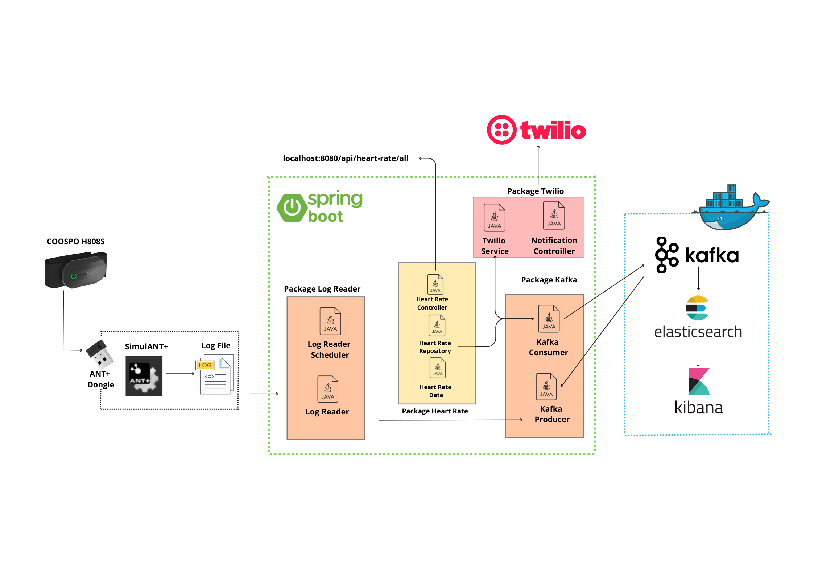

# Heart Rate Monitoring System

## Introduction
Ce projet est un système de surveillance du rythme cardiaque basé sur Spring Boot, Kafka et Twilio. Il permet de collecter, traiter et analyser les données de fréquence cardiaque à partir d'un capteur COSPO H808S connecté via ANT+.

## Architecture du Projet
L'architecture repose sur plusieurs composants interconnectés :
- **Spring Boot** : Framework principal pour le backend.
- **Kafka** : Utilisé pour la gestion des événements de fréquence cardiaque.
- **Elasticsearch & Kibana** : Stockage et visualisation des données.
- **Twilio** : Service de notification en cas d'anomalie.
- **Docker** : Conteneurisation des services.

### Diagramme d'architecture


## Installation et Configuration
### Prérequis
- Java 22
- Docker et Docker Compose
- Kafka et Zookeeper
- Elasticsearch et Kibana
- Compte Twilio pour les notifications SMS

### Installation
1. Cloner le dépôt :
   ```bash
   git clone https://github.com/malakhbiyel/heart-rate-monitoring.git
   cd heart-rate-monitoring
   ```
2. Lancer les services avec Docker Compose :
   ```bash
   docker-compose up -d
   ```
3. Démarrer l'application Spring Boot :
   ```bash
   mvn spring-boot:run
   ```

## Utilisation
### API Endpoints
- **Récupération des données de fréquence cardiaque** :
  ```http
  GET http://localhost:8080/api/heart-rate/all
  ```

### Fonctionnalités
- **Lecture des logs** : Analyse des fichiers de données.
- **Production Kafka** : Envoi des événements au broker Kafka.
- **Consommation Kafka** : Traitement des événements reçus.
- **Stockage dans Elasticsearch** : Indexation des données pour l'analyse.
- **Notifications Twilio** : Alertes en cas d'irrégularités cardiaques.

## Contribution
Les contributions sont les bienvenues ! Merci de créer une issue ou une pull request.


